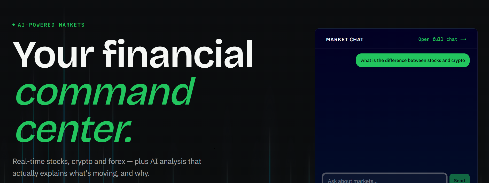

# FinFolio — AI Finance Tracker

A full-stack finance dashboard for tracking stocks, crypto, and forex in real time, with AI-generated market insights and chat — built for retail traders and finance-curious users who want one place to watch markets and ask questions about what's moving.

**Live demo:** [finfolio-app-uhwj.vercel.app](https://finfolio-app-uhwj.vercel.app/)

---

## Features

- Real-time stock, crypto, and forex price tracking with live WebSocket updates
- AI-generated daily market summaries and per-symbol analysis (Google Gemini)
- Conversational AI market chat, grounded in live data
- Simulated portfolio trading — buy/sell with a virtual cash balance, live gain/loss
- Personal watchlist for tracking symbols of interest
- Forex rate charts with historical OHLC data
- Market news feed with sentiment scoring
- Upcoming IPO calendar
- JWT-based authentication with anonymous/guest chat support

---

## Tech Stack

| Layer | Technology |
|---|---|
| Language | TypeScript (frontend), JavaScript/CommonJS (backend) |
| Frontend framework | Next.js 15 (App Router, Turbopack), React 19 |
| Styling / UI | Tailwind CSS 4, shadcn/ui (Radix UI), Lucide icons |
| Charts | Recharts |
| Backend framework | Node.js, Express 5 |
| Database | PostgreSQL, via Prisma ORM |
| Real-time | Socket.io |
| AI | Google Gemini (`gemini-2.5-flash`) |
| Auth | JWT (`jsonwebtoken`), `bcryptjs` |
| Hosting | Vercel (frontend), Railway (backend + database) |
| Notable libraries | Axios, `node-cron`, `express-rate-limit`, `helmet`, Sonner |
